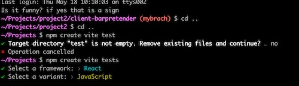
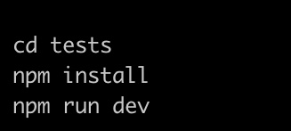

# BARPRETENDER

Project on live [coming soon]

## MOTIVATION

BarPretender is a cocktail recipe app. It has two features. The one feature is that an user can  choose a cocktail from a list to access a recipe. Another feature enables users to select some ingredients they have at hand and list out what cocktails can be made with selected ingredients.

## ABOUT

- Front-end of BarPretender was developed with a JavaScript framework, React.
- Build Tool used for the app is Vite.
- Upon starting on this project, select react for a framework and select Javascript for a variant.

- Go into the director by running cd -filename-.
- Run npm install command.
- To run the localhost server, run npm run dev command in the terminal. URL is localhost:5173, or other numbers that is shown in the terminal.

- Dependency used for building this app are  axios 1.4.0, react-dom 18.2.0 and react-router-dom 6.11.1.
- These also need to be installed by running npm install -dependency-name-.
- This is a three page app, the first page being the sign-up and log-in. The second page where the user can select ingredients and access recipes and the third page is limited to the admin to be able to create/edit/delete recipe list.

## FEATURES

1. **Ingredient Selection:** Choose from a variety of ingredients, including base spirits, other alcohols, and other ingredients. 

2. **Cocktail Suggestions:** As you select ingredients, the app dynamically generates a list of cocktails that you can create with those ingredients.

3. **Cocktail Recipes:** When you select a cocktail from the list, Bar-Pretender will display the recipe for that cocktail, including the specific quantities of each ingredient and the method to create the cocktail.

## BACKEND

- This project utilizes RAILS as the backend server. The React app handles the frontend user interface and interactions, while Rails serves as the backend to handle data storage, retrieval, and API endpoints.

## PLANNING AND APPROACHES

- BarPretender was a group project built as Project 2 for Software Engineering Immersive course at General Assembly
- As a group we spent some time to plan both backend and frontend together.
- This is the working tree we have worked off

## FURTHER IMPROVEMENTS

- Currently only the admin can make contributions to the app through create/edit/delete functions. This feature can be extended to the users.
- Further interactions with the user can be implemented. For example, users can like/dislike cocktails or can add comments to be more interactive.
- Implement a feature the app chooses a random cocktail.
- Implement 'forget username, password' feature.
- Better styling of the app.

## LESSONS LEARNT

- How to work as a team efficiently by taking advantage of the strength of individual collaborators.
- How to use version control - this took a lot of our time and there are improvements to be made to use this more competently.
- Communication between individual members is crucial to the workflow and goal achievement.
- Acknowledging different ways of programming.

## Credit

[flatiocon](https://www.flaticon.com/) - Provided icons for ingredients list in the app.

We would like to thank each other for working well together by being dedicated team members. We would also like to thank the teaching team, cohort and friends to support us to bring this project alive.

## License

The Bar-Pretender app is open-source software licensed under the [MIT license](./LICENSE).